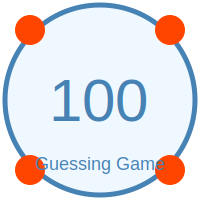

# Number Guessing Game 🎲
---

[In C script](https://github.com/mdriyadkhan585/number-guessing-game)



---
Welcome to the **Number Guessing Game**! This Python program challenges you to guess a randomly selected number between 1 and 100. See how many attempts it takes you to get it right!

## 📜 Description

The game generates a random number between 1 and 100. Your goal is to guess this number. The game provides feedback on whether your guess is too high or too low and tracks the number of attempts. You have a maximum of 10 attempts to guess the number correctly.

## 🛠️ Features

- Random number generation between 1 and 100.
- Feedback on whether your guess is too high or too low.
- Attempt counter with a maximum of 10 attempts.
- User-friendly and engaging output.

## 🚀 Getting Started

Follow these steps to set up and run the game on your local machine.

### Prerequisites

- Python 3.x installed on your system.

### Installation

1. **Clone the Repository**

   ```bash
   git clone https://github.com/mdriyadkhan585/number-guessing-game_Python.git
   ```

2. **Navigate to the Project Directory**

   ```bash
   cd number-guessing-game
   ```

3. **Run the Python Script**

   ```bash
   python number_guessing_game.py
   ```

## 🎮 How to Play

1. **Start the Game**: Run the Python script. The game will generate a random number between 1 and 100.

2. **Make a Guess**: Enter your guess when prompted. The program will inform you if your guess is too high or too low.

3. **Continue Guessing**: You have up to 10 attempts to guess the correct number.

4. **Win or Lose**: If you guess the number correctly within 10 attempts, you win. If not, the correct number will be revealed at the end.

## 📖 Example Output

```
====================================
   Welcome to the Number Guessing Game!
====================================
I have selected a number between 1 and 100.
Can you guess what it is?

Attempt 1/10
Enter your guess: 50
Your guess is too high! Try again.

Attempt 2/10
Enter your guess: 25
Your guess is too low! Try again.

Attempt 3/10
Enter your guess: 37
Congratulations! You guessed the number 37 in 3 attempts.

Game Over
====================================
```


## repository Profile 

- **GitHub**: [https://github.com/mdriyadkhan585](https://github.com/mdriyadkhan585)

Enjoy the game and happy guessing! 🎉
---
